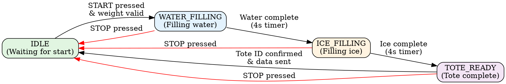
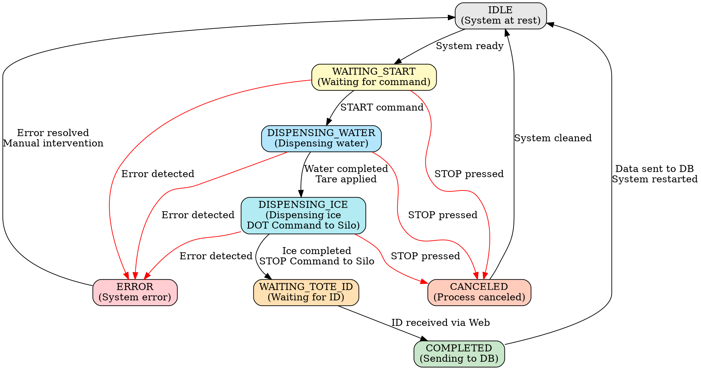
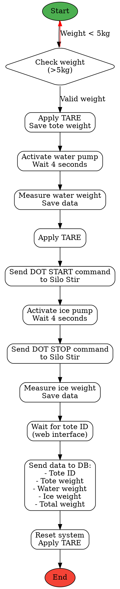

# Tote Inbound - Tote Filling Control System

Embedded automatic control system for filling totes with water and ice, with integration to Marel M2200 scale and communication with Silo Stir system for ice dispensing control.

## 📋 General Description

This system controls the automated process of filling totes (containers) with precise amounts of water and ice. The system:

- **Controls sequential filling** of water and ice through a state machine
- **Communicates with a Marel M2200 scale** via Ethernet for real-time weight measurements
- **Sends DOT commands to the Silo Stir machine** to control ice dispensing
- **Records data** for each tote (ID, water weight, ice weight, tote weight) for database submission
- **Provides web interface** for remote monitoring and control via WiFi
- **Supports manual control** through physical buttons and serial commands

## 🏭 System Architecture

### Hardware

- **Microcontroller**: ESP32 (EdgeBox ESP-100)
- **Scale**: Marel M2200 (Ethernet Communication)
- **Silo Stir Interface**: DOT commands for ice control
- **Digital Inputs** (4):
  - `DI_0`: START Button
  - `DI_1`: STOP Button
  - `DI_2`: MANUAL WATER Button
  - `DI_3`: MANUAL ICE Button
  
- **Digital Outputs** (3):
  - `DO_0`: Ice pump control (START)
  - `DO_1`: Ice pump control (STOP)
  - `DO_2`: Water pump control

### Software

- **Framework**: Arduino/PlatformIO
- **Communication**: WiFi (AsyncWebServer + WebSockets), Ethernet (Marel)
- **Scheduler**: TaskScheduler for asynchronous tasks
- **OTA**: Over-The-Air update enabled

## 🔄 State Machine

### Controller States (ControllerState)



### Tote States (ToteState) - New Implementation



## 📊 Process Flow



## 🔌 Silo Stir Communication

The system communicates with the Silo Stir machine using **DOT commands** to control ice dispensing:

### DOT Command Protocol

- **START ICE**: 200ms pulse on `DO_0` (ICE_PUMP HIGH → LOW)
  - Starts ice dispensing from Silo Stir
  
- **STOP ICE**: 200ms pulse on `DO_1` (ICE_STOP HIGH → LOW)
  - Stops ice dispensing from Silo Stir

### Control Sequence

```
1. System detects Stage 2 (ICE_FILLING)
2. Sends START command → Silo Stir begins dispensing
3. Waits configured time (4 seconds default)
4. Sends STOP command → Silo Stir stops dispensing
5. Measures final weight of dispensed ice
```

## 📡 Marel M2200 Scale Integration

### Communication Protocol

The system communicates with the Marel M2200 scale via **Ethernet TCP/IP** using proprietary commands:

#### Available Commands

| Command | Format | Description | Example |
|---------|---------|-------------|---------|
| **READ** | `.R<ID>:<dimension>\n` | Reads model value | `.R85:2\n` (weight) |
| **WRITE** | `.W<ID>:<value>\n` | Writes value | `.W113:0.00\n` (tare) |

#### Model IDs

- **WEIGHT_ID (85)**: Current weight reading
- **TARE_ID (113)**: Tare configuration

#### Response Example

```
Command: .R85:2\n
Response: .D.85.2:76.40kg
Parsed: 76.40
```

### Network Configuration

```cpp
Server IP: 192.168.1.7
Server Port: 5200
Client IP: 192.168.1.29
MAC Address: DE:AD:BE:EF:FE:ED
```

## 💾 Data Structure

### `tote_data` Structure

```cpp
typedef struct {
  char id[32];              // Unique tote ID
  uint32_t water_out_kg;    // Water weight (kg)
  uint32_t ice_out_kg;      // Ice weight (kg)
  uint32_t tote_weight;     // Empty tote weight (kg)
  uint32_t raw_weight;      // Current total weight (kg)
} tote_data;
```

### Data Sent to Database

When completing a cycle, the system collects and prepares the following data for database submission:

- **Tote ID**: Unique identifier entered via web interface
- **Empty Tote Weight**: Measured at process start
- **Water Weight**: Difference after water filling
- **Ice Weight**: Difference after ice filling
- **Total Weight**: Sum of all components
- **Timestamp**: Record date and time (future)

## 🌐 Web Interface

### Features

1. **Real-Time Monitoring**
   - Current weight display via WebSocket
   - Update every 200ms (if changes)
   - Process status

2. **Tote ID Input**
   - Input field for unique ID
   - Validation (max. 32 characters)
   - Visual confirmation

3. **Remote Control** (future)
   - Virtual START/STOP buttons
   - Manual pump control
   - State visualization

### WiFi Configuration

```cpp
SSID: MFP-Guest24
Password: testing123
Hostname: tote-inbound
```

### Endpoints

- `/`: Main page
- `/ws`: WebSocket for real-time data
- OTA: Port 3232

## 🔧 Installation and Configuration

### Prerequisites

- ⚠️ **Git** installed
- ⚠️ **PlatformIO** installed (VS Code extension or CLI)
- ESP32 toolchain configured

### Installation Steps

1. **Clone the repository**
```bash
git clone https://github.com/ayam-brand-IOT/Water_ice.git
cd Water_ice
git checkout new_structure
```

2. **Open in PlatformIO**
```bash
code .
```

3. **Configure parameters in `include/config.h`**
   - WiFi credentials
   - Marel scale IP
   - Process parameters

4. **Compile and upload**
```bash
pio run -t upload
```

5. **Monitor Serial**
```bash
pio device monitor -b 115200
```

### Network Configuration

Edit `include/config.h`:

```cpp
// WiFi
#define U_SSID "YOUR_SSID"
#define U_PASS "YOUR_PASSWORD"

// Marel M2200
#define SERVER_IP "192.168.1.7"
#define SERVER_PORT 5200
#define CLIENT_IP {192, 168, 1, 29}
```

## 🎮 System Usage

### Automatic Mode

1. Place empty tote on scale
2. Verify weight is > 5kg
3. Press **START** (physical button or serial command `1`)
4. System will automatically execute:
   - Water filling (Stage 1)
   - Ice filling with Silo Stir command (Stage 2)
   - Tote ID request (Stage 3)
5. Enter tote ID in web interface
6. System will send data to DB and return to IDLE

### Manual Mode

- **Manual Water**: Press `DI_2` button or send `3` via serial (5 seconds)
- **Manual Ice**: Press `DI_3` button or send `2` via serial (5 seconds)
- **Stop**: Press `DI_1` button or send `0` via serial

### Serial Commands

Send numbers via Serial at 115200 baud:

| Command | Action |
|---------|--------|
| `0` | STOP |
| `1` | START |
| `2` | Manual Ice (5s) |
| `3` | Manual Water (5s) |

## 📁 Project Structure

```
tote_inbound/
├── include/
│   ├── config.h              # General system configuration
│   └── Types.h               # Structure and enum definitions
├── lib/
│   ├── DISPLAY/              # Display library (not currently used)
│   └── SD/                   # SD library (not currently used)
├── src/
│   ├── main.cpp              # Main loop and state logic
│   ├── main.h                # Main function declarations
│   ├── marel.cpp             # Marel M2200 client
│   ├── marel.h               # Marel client header
│   ├── Stage.cpp             # Stage implementation
│   ├── Stage.h               # Stage class for phase management
│   └── hardware/
│       ├── Controller.cpp    # Main hardware controller
│       ├── Controller.h      # Controller header
│       ├── WIFI.cpp          # WiFi and WebServer management
│       ├── WIFI.h            # WiFi header
│       └── resources/
│           ├── WebFiles.cpp  # Embedded HTML/CSS/JS files
│           └── WebFiles.h    # Web resources header
├── platformio.ini            # PlatformIO configuration
└── README.md                 # This file
```

## 🔍 Debugging

### Debug Messages

The system prints detailed messages via Serial:

```
[Controller]: State changed from 0 to 1
[Stage]: Current step: 1
Raw Weight: 76.40
Parsed Weight: 76.40
Stage 1 Filling Water
Water: 15 kg
Water filling completed
```

### Real-Time Weight Monitoring

Connect to WebSocket at `ws://tote-inbound.local/ws` to receive weight updates:

```json
{
  "type": "weight",
  "value": 76.40
}
```

## 🚀 OTA Updates

The system supports Over-The-Air updates:

1. Device announces mDNS as `tote-inbound.local`
2. Use PlatformIO to upload firmware:
```bash
pio run -t upload --upload-port tote-inbound.local
```

## 📊 Future Implementations

### Database

- [ ] Implement HTTP/MQTT client for data submission
- [ ] Add RTC timestamp
- [ ] Implement data queue in case of connection loss
- [ ] Historical visualization dashboard

### ToteState Improvements

- [ ] Complete `handleToteState()` implementation
- [ ] Integrate with controller states
- [ ] Add specific error handling
- [ ] Implement timeouts per state

### Silo Stir Control

- [ ] Add DOT command reception confirmation
- [ ] Implement Silo status feedback
- [ ] Variable ice flow control

## 🤝 Contributions

This project is part of the plant processing automation system.

**Developer**: ayam-brand-IOT  
**Repository**: Water_ice  
**Current Branch**: new_structure

## 📝 Additional Notes

- The system uses **TaskScheduler** to avoid blocking delays
- WiFi communications run on a **separate Core** (Core 0)
- Marel scale requires **stable Ethernet connection**
- DOT commands to Silo Stir are **200ms pulses**
- The system records **automatic tare** between stages for precise measurements

## 🐛 Troubleshooting

### Scale not responding

- Verify Ethernet connection (cable and switch)
- Verify scale IP (ping 192.168.1.7)
- Check timeout in `MarelClient` (5000ms)

### WiFi won't connect

- Verify credentials in `config.h`
- Verify ESP32 is in range
- Check serial for error messages

### Silo Stir not responding to DOT commands

- Verify digital outputs connection `DO_0` and `DO_1`
- Verify 200ms pulses are sufficient
- Check Silo Stir configuration to accept commands

---

**Version**: 1.0.0  
**Date**: November 2025  
**Hardware**: EdgeBox ESP-100 + Marel M2200 + Silo Stir
