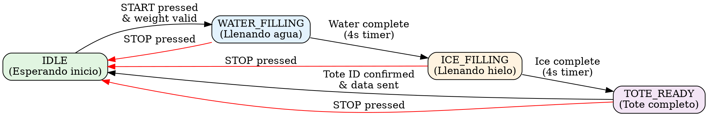
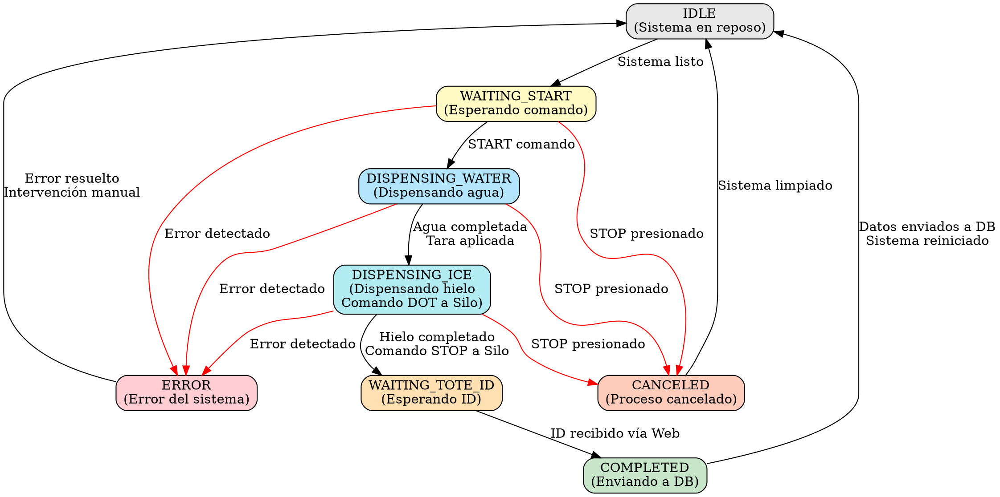
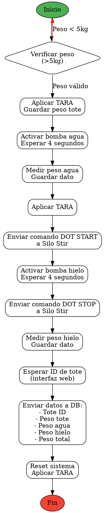

# Tote Inbound - Sistema de Control de Llenado de Totes

Sistema embebido de control automático para el llenado de totes con agua y hielo, con integración a báscula Marel M2200 y comunicación con sistema Silo Stir para control de dispensación de hielo.

## 📋 Descripción General

Este sistema controla el proceso automatizado de llenado de totes (contenedores) con cantidades precisas de agua y hielo. El sistema:

- **Controla el llenado secuencial** de agua y hielo mediante una máquina de estados
- **Se comunica con una báscula Marel M2200** vía Ethernet para mediciones de peso en tiempo real
- **Envía comandos DOT a la máquina Silo Stir** para controlar la dispensación de hielo
- **Registra datos** de cada tote (ID, peso de agua, peso de hielo, peso del tote) para envío a base de datos
- **Proporciona interfaz web** para monitoreo y control remoto vía WiFi
- **Soporta control manual** mediante botones físicos y comandos seriales

## 🏗️ Arquitectura del Sistema

### Hardware

- **Microcontrolador**: ESP32 (EdgeBox ESP-100)
- **Báscula**: Marel M2200 (Comunicación Ethernet)
- **Interface Silo Stir**: Comandos DOT para control de hielo
- **Entradas Digitales** (4):
  - `DI_0`: Botón START
  - `DI_1`: Botón STOP
  - `DI_2`: Botón AGUA MANUAL
  - `DI_3`: Botón HIELO MANUAL
  
- **Salidas Digitales** (3):
  - `DO_0`: Control bomba de hielo (START)
  - `DO_1`: Control bomba de hielo (STOP)
  - `DO_2`: Control bomba de agua

### Software

- **Framework**: Arduino/PlatformIO
- **Comunicación**: WiFi (AsyncWebServer + WebSockets), Ethernet (Marel)
- **Scheduler**: TaskScheduler para tareas asíncronas
- **OTA**: Actualización Over-The-Air habilitada

## 🔄 Máquina de Estados

### Estados del Controlador (ControllerState)



### Estados del Tote (ToteState) - Nueva Implementación



## 📊 Flujo del Proceso



## 🔌 Comunicación con Silo Stir

El sistema se comunica con la máquina Silo Stir mediante **comandos DOT** para controlar el dispensado de hielo:

### Protocolo de Comandos DOT

- **START ICE**: Pulso de 200ms en `DO_0` (ICE_PUMP HIGH → LOW)
  - Inicia la dispensación de hielo desde el Silo Stir
  
- **STOP ICE**: Pulso de 200ms en `DO_1` (ICE_STOP HIGH → LOW)
  - Detiene la dispensación de hielo del Silo Stir

### Secuencia de Control

```
1. Sistema detecta Stage 2 (ICE_FILLING)
2. Envía comando START → Silo Stir comienza dispensación
3. Espera tiempo configurado (4 segundos por defecto)
4. Envía comando STOP → Silo Stir detiene dispensación
5. Mide peso final del hielo dispensado
```

## 📡 Integración con Báscula Marel M2200

### Protocolo de Comunicación

El sistema se comunica con la báscula Marel M2200 vía **Ethernet TCP/IP** usando comandos propietarios:

#### Comandos Disponibles

| Comando | Formato | Descripción | Ejemplo |
|---------|---------|-------------|---------|
| **READ** | `.R<ID>:<dimension>\n` | Lee valor del modelo | `.R85:2\n` (peso) |
| **WRITE** | `.W<ID>:<value>\n` | Escribe valor | `.W113:0.00\n` (tara) |

#### Model IDs

- **WEIGHT_ID (85)**: Lectura de peso actual
- **TARE_ID (113)**: Configuración de tara

#### Ejemplo de Respuesta

```
Comando: .R85:2\n
Respuesta: .D.85.2:76.40kg
Parsed: 76.40
```

### Configuración de Red

```cpp
Server IP: 192.168.1.7
Server Port: 5200
Client IP: 192.168.1.29
MAC Address: DE:AD:BE:EF:FE:ED
```

## 💾 Estructura de Datos

### Estructura `tote_data`

```cpp
typedef struct {
  char id[32];              // ID único del tote
  uint32_t water_out_kg;    // Peso del agua (kg)
  uint32_t ice_out_kg;      // Peso del hielo (kg)
  uint32_t tote_weight;     // Peso del tote vacío (kg)
  uint32_t raw_weight;      // Peso total actual (kg)
} tote_data;
```

### Datos Enviados a Base de Datos

Al completar un ciclo, el sistema recopila y prepara los siguientes datos para envío a la base de datos:

- **Tote ID**: Identificador único ingresado vía interfaz web
- **Peso del Tote Vacío**: Medido al inicio del proceso
- **Peso del Agua**: Diferencia después del llenado de agua
- **Peso del Hielo**: Diferencia después del llenado de hielo
- **Peso Total**: Suma de todos los componentes
- **Timestamp**: Fecha y hora del registro (futuro)

## 🌐 Interfaz Web

### Funcionalidades

1. **Monitoreo en Tiempo Real**
   - Visualización de peso actual vía WebSocket
   - Actualización cada 200ms (si hay cambios)
   - Estado del proceso

2. **Ingreso de ID de Tote**
   - Campo de entrada para ID único
   - Validación (máx. 32 caracteres)
   - Confirmación visual

3. **Control Remoto** (futuro)
   - Botones virtuales START/STOP
   - Control manual de bombas
   - Visualización de estados

### Configuración WiFi

```cpp
SSID: MFP-Guest24
Password: testing123
Hostname: tote-inbound
```

### Endpoints

- `/`: Página principal
- `/ws`: WebSocket para datos en tiempo real
- OTA: Puerto 3232

## 🔧 Instalación y Configuración

### Requisitos Previos

- ⚠️ **Git** instalado
- ⚠️ **PlatformIO** instalado (extensión de VS Code o CLI)
- ESP32 toolchain configurado

### Pasos de Instalación

1. **Clonar el repositorio**
```bash
git clone https://github.com/ayam-brand-IOT/Water_ice.git
cd Water_ice
git checkout new_structure
```

2. **Abrir en PlatformIO**
```bash
code .
```

3. **Configurar parámetros en `include/config.h`**
   - Credenciales WiFi
   - IP de la báscula Marel
   - Parámetros de proceso

4. **Compilar y subir**
```bash
pio run -t upload
```

5. **Monitorear Serial**
```bash
pio device monitor -b 115200
```

### Configuración de Red

Editar `include/config.h`:

```cpp
// WiFi
#define U_SSID "TU_SSID"
#define U_PASS "TU_PASSWORD"

// Marel M2200
#define SERVER_IP "192.168.1.7"
#define SERVER_PORT 5200
#define CLIENT_IP {192, 168, 1, 29}
```

## 🎮 Uso del Sistema

### Modo Automático

1. Colocar tote vacío en la báscula
2. Verificar que el peso sea > 5kg
3. Presionar **START** (botón físico o comando serial `1`)
4. El sistema ejecutará automáticamente:
   - Llenado de agua (Stage 1)
   - Llenado de hielo con comando a Silo Stir (Stage 2)
   - Solicitud de ID de tote (Stage 3)
5. Ingresar ID del tote en la interfaz web
6. El sistema enviará datos a DB y volverá a IDLE

### Modo Manual

- **Agua Manual**: Presionar botón `DI_2` o enviar `3` por serial (5 segundos)
- **Hielo Manual**: Presionar botón `DI_3` o enviar `2` por serial (5 segundos)
- **Detener**: Presionar botón `DI_1` o enviar `0` por serial

### Comandos Seriales

Enviar números por Serial a 115200 baud:

| Comando | Acción |
|---------|--------|
| `0` | STOP |
| `1` | START |
| `2` | Hielo Manual (5s) |
| `3` | Agua Manual (5s) |

## 📁 Estructura del Proyecto

```
tote_inbound/
├── include/
│   ├── config.h              # Configuración general del sistema
│   └── Types.h               # Definiciones de estructuras y enums
├── lib/
│   ├── DISPLAY/              # Librería de displays (no utilizada actualmente)
│   └── SD/                   # Librería SD (no utilizada actualmente)
├── src/
│   ├── main.cpp              # Loop principal y lógica de estados
│   ├── main.h                # Declaraciones de funciones principales
│   ├── marel.cpp             # Cliente Marel M2200
│   ├── marel.h               # Header del cliente Marel
│   ├── Stage.cpp             # Implementación de stages
│   ├── Stage.h               # Clase Stage para manejo de etapas
│   └── hardware/
│       ├── Controller.cpp    # Controlador principal del hardware
│       ├── Controller.h      # Header del controlador
│       ├── WIFI.cpp          # Gestión WiFi y WebServer
│       ├── WIFI.h            # Header WiFi
│       └── resources/
│           ├── WebFiles.cpp  # Archivos HTML/CSS/JS embebidos
│           └── WebFiles.h    # Header de recursos web
├── platformio.ini            # Configuración de PlatformIO
└── README.md                 # Este archivo
```

## 🔍 Debugging

### Mensajes de Debug

El sistema imprime mensajes detallados por Serial:

```
[Controller]: State changed from 0 to 1
[Stage]: Current step: 1
Raw Weight: 76.40
Parsed Weight: 76.40
Stage 1 Filling Water
Water: 15 kg
Water filling completed
```

### Monitoreo de Peso en Tiempo Real

Conectarse a WebSocket en `ws://tote-inbound.local/ws` para recibir actualizaciones de peso:

```json
{
  "type": "weight",
  "value": 76.40
}
```

## 🚀 Actualizaciones OTA

El sistema soporta actualizaciones Over-The-Air:

1. El dispositivo anuncia mDNS como `tote-inbound.local`
2. Usar PlatformIO para subir firmware:
```bash
pio run -t upload --upload-port tote-inbound.local
```

## 📊 Próximas Implementaciones

### Base de Datos

- [ ] Implementar cliente HTTP/MQTT para envío de datos
- [ ] Agregar timestamp RTC
- [ ] Implementar cola de datos en caso de pérdida de conexión
- [ ] Dashboard de visualización histórica

### Mejoras ToteState

- [ ] Completar la implementación de `handleToteState()`
- [ ] Integrar con estados del controlador
- [ ] Agregar manejo de errores específicos
- [ ] Implementar timeouts por estado

### Control Silo Stir

- [ ] Agregar confirmación de recepción de comandos DOT
- [ ] Implementar feedback de estado del Silo
- [ ] Control de flujo de hielo variable

## 🤝 Contribuciones

Este proyecto es parte del sistema de automatización de la planta de procesamiento.

**Desarrollador**: ayam-brand-IOT  
**Repositorio**: Water_ice  
**Branch Actual**: new_structure

## 📝 Notas Adicionales

- El sistema usa **TaskScheduler** para evitar delays bloqueantes
- Las comunicaciones WiFi corren en un **Core separado** (Core 0)
- La báscula Marel requiere **conexión Ethernet estable**
- Los comandos DOT al Silo Stir son **pulsos de 200ms**
- El sistema registra **tara automática** entre etapas para mediciones precisas

## 🐛 Troubleshooting

### La báscula no responde

- Verificar conexión Ethernet (cable y switch)
- Verificar IP de la báscula (ping 192.168.1.7)
- Revisar timeout en `MarelClient` (5000ms)

### WiFi no conecta

- Verificar credenciales en `config.h`
- Verificar que el ESP32 esté en rango
- Revisar serial para mensajes de error

### Silo Stir no responde a comandos DOT

- Verificar conexión de salidas digitales `DO_0` y `DO_1`
- Verificar que los pulsos de 200ms sean suficientes
- Revisar configuración del Silo Stir para aceptar comandos

---

**Versión**: 1.0.0  
**Fecha**: Noviembre 2025  
**Hardware**: EdgeBox ESP-100 + Marel M2200 + Silo Stir
